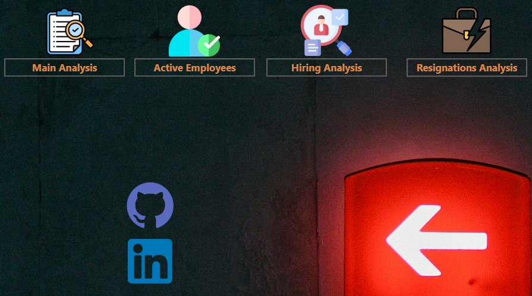
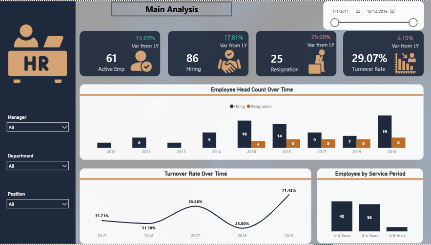
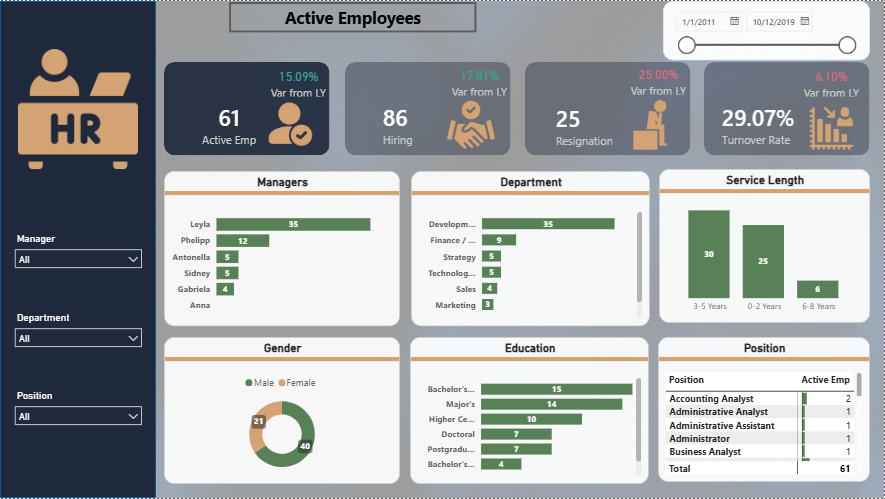
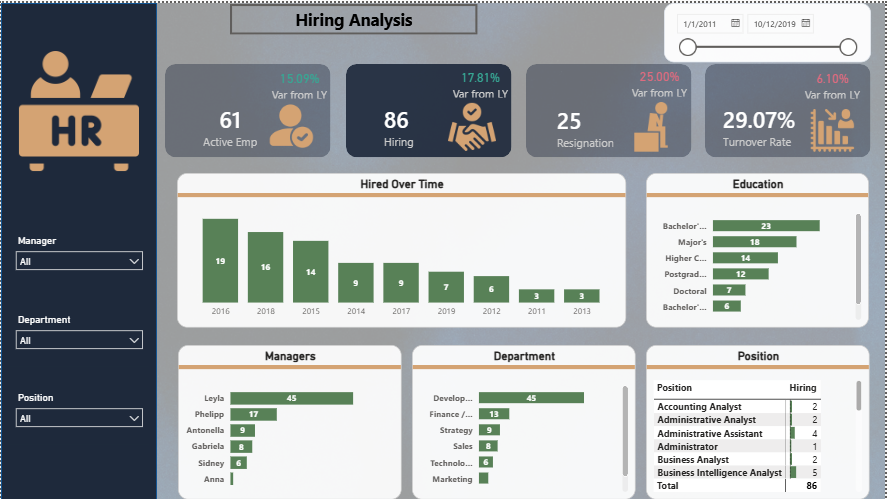
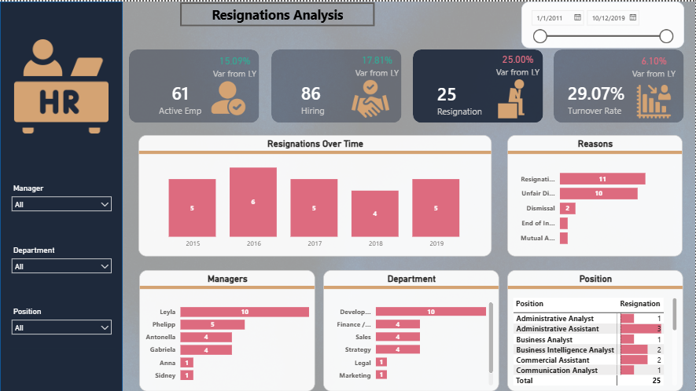

# 📊 HR Analytics & Workforce Performance Analysis

A comprehensive Power BI business intelligence solution designed to analyze organizational workforce dynamics, track employee lifecycle metrics, monitor departmental distribution, and evaluate hiring vs. resignation trends over time.

---

## 🛠️ Project Overview & Architecture

This project transforms raw human resources data into actionable executive insights utilizing a structured analytical model:
* **Core Metrics Tracked:** Active Headcount, Total Hirings, Resignation Volumes, Turnover Rates, and Service Length distribution.
* **Interactive Filtering:** Global slicers for Managers, Departments, and Positions across all dashboard views.
* **Dynamic Time Intelligence:** Date range slider enabling period-over-period comparative analysis.

---

## 📸 Dashboard Preview & Screenshots

### 1. Main Analysis Overview
The primary executive landing page providing a high-level summary of active headcounts, general turnover dynamics, and year-over-year performance variances.

### 2. Active Employees Analysis
Detailed demographic and departmental breakdown of current active employees categorized by manager, department, service length, gender, and education level.

### 3. Hiring Analysis
Longitudinal tracking of recruitment patterns, identifying peak hiring seasons, top-performing sourcing channels, and department-wise talent acquisition distribution.

### 4. Resignations Analysis
Diagnostic view tracking employee turnover triggers, resignation timelines, primary leaving reasons, and departmental attrition hotspots.

---

## 🚀 Key Features & Business Value
* **Trend Analysis:** Visualizing the evolution of workforce headcounts and turnover coefficients over multi-year horizons.
* **Performance Indicators (KPIs):** Instant comparison against Last Year (LY) to measure strategic HR policy effectiveness.
* **Risk Identification:** Pinpointing departments and management lines experiencing high attrition to implement preemptive retention strategies.

---
*Developed with 💡 by [Mamdooh](https://github.com/Mamdo0uh)*
